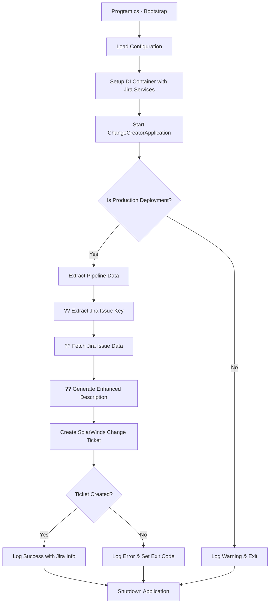

# ChangeRequesThor Solution Guide

## Overview
**ChangeRequesThor** is a .NET 9 console application that automatically creates SolarWinds change management tickets for production deployments. It integrates with GitHub Actions CI/CD pipelines and **Jira** to create enhanced change tickets with AI-powered description enhancement, and only runs for production environments.

## ?? **New Features**
- **Jira Integration**: Automatically detects and fetches associated Jira issues
- **AI-Enhanced Descriptions**: Scrubs and enhances Jira ticket information for professional change descriptions
- **Smart Risk Assessment**: Analyzes Jira issue properties to generate risk assessments
- **Comprehensive Ticket Details**: Includes Jira metadata, components, and priority information

---

## ??? **Solution Architecture**

### **1. Entry Point (`Program.cs`)**
**Purpose**: Application bootstrap and dependency injection setup

**Key Features**:
- **Configuration Management**: Loads settings from `appsettings.json`, environment variables, and Azure Key Vault
- **Azure Key Vault Integration**: Securely retrieves secrets using `DefaultAzureCredential`
- **Dependency Injection**: Registers all services including new Jira services
- **Host Builder**: Sets up the application as a hosted service for clean startup/shutdown

**Configuration Sources** (in order of precedence):
1. `appsettings.json`
2. Environment variables
3. Azure Key Vault (`https://kv-changeomatic-snd.vault.azure.net`)

**Key Dependencies Registered**:
```csharp
// Configuration binding
services.Configure<SolarWindsSettings>(finalConfig.GetSection("SolarWinds"));
services.Configure<JiraSettings>(finalConfig.GetSection("Jira"));

// HTTP Clients
services.AddHttpClient<IChangeAutomationService, SolarWindsService>();
services.AddHttpClient<IJiraService, JiraService>();

// Services
services.AddSingleton<IGitHubPipelineService, GitHubPipelineService>();
services.AddSingleton<IDescriptionEnhancementService, DescriptionEnhancementService>();
services.AddHostedService<ChangeCreatorApplication>();
```

---

### **2. Main Application Logic (`ChangeCreatorApplication.cs`)**
**Purpose**: Core business logic and application workflow orchestration

**Enhanced Workflow**:
1. **Environment Check**: Verifies if this is a production deployment
2. **Pipeline Data Extraction**: Gathers release information from environment variables
3. **?? Jira Issue Detection**: Automatically extracts Jira issue keys from various sources
4. **?? Enhanced Change Ticket Creation**: Creates tickets with Jira-enriched descriptions
5. **Logging & Exit**: Logs results with Jira integration status

**Enhanced Logging Output**:
```
Release ID: v1.2.3, Jira Issue: PROJ-123, Created SolarWinds Change Ticket: CHG0001234
```

---

### **3. Services Layer**

#### **A. SolarWindsService (`Services/SolarWindsService.cs`)**
**Purpose**: Handles all SolarWinds API interactions with Jira integration

**Enhanced Responsibilities**:
- **HTTP Client Management**: Configures authentication headers and base URL
- **?? Jira-Enhanced Change Requests**: Integrates with Jira service for richer content
- **?? Smart Change Naming**: Uses Jira issue summary in change ticket names
- **API Token Management**: Uses tokens from configuration (populated by Azure Key Vault)
- **Error Handling**: Provides detailed logging for troubleshooting

**Enhanced Change Ticket Details**:
- **Name**: "Production Deployment - PROJ-123: Implement new authentication system"
- **Timing**: Start +30 mins, End +2 hours from creation
- **Description**: AI-enhanced with Jira details, risk assessment, and deployment context

#### **B. GitHubPipelineService (`Services/GitHubPipelineService.cs`)**
**Purpose**: Extracts deployment context from GitHub Actions environment

**Enhanced Data Sources**:
- **Release ID**: `GITHUB_REF_NAME`, `GITHUB_SHA`, `RELEASE_ID`, `GITHUB_RUN_ID`
- **Repository**: `GITHUB_REPOSITORY`, `REPO_NAME`
- **Branch**: `GITHUB_REF_NAME`, `GITHUB_HEAD_REF`, `GITHUB_BASE_REF`
- **Environment**: `DEPLOYMENT_ENVIRONMENT`, `ENVIRONMENT`, `DEPLOY_ENV`
- **?? Jira Issue Key**: Extracted from branch names, commit messages, PR titles using regex

**Jira Issue Detection Logic**:
```csharp
private static readonly Regex JiraKeyRegex = new(@"\b([A-Z]+-\d+)\b", RegexOptions.Compiled);

// Searches through:
// - JIRA_ISSUE_KEY environment variable
// - Branch names (feature/PROJ-123-new-feature)
// - Commit messages
// - Pull request titles
```

#### **?? C. JiraService (`Services/JiraService.cs`)**
**Purpose**: Handles all Jira API interactions

**Responsibilities**:
- **Issue Retrieval**: Fetches complete Jira issue information
- **Authentication**: Uses Basic Auth with Jira API tokens
- **Description Parsing**: Handles both plain text and Atlassian Document Format (ADF)
- **Error Handling**: Graceful fallback when Jira is unavailable

**API Configuration**:
```csharp
// Basic Authentication
var authValue = Convert.ToBase64String(Encoding.UTF8.GetBytes($"{username}:{apiToken}"));
_httpClient.DefaultRequestHeaders.Authorization = new AuthenticationHeaderValue("Basic", authValue);
```

#### **?? D. DescriptionEnhancementService (`Services/DescriptionEnhancementService.cs`)**
**Purpose**: AI-powered description enhancement and content scrubbing

**Enhancement Features**:
- **Jira Content Integration**: Extracts and cleans Jira descriptions
- **Risk Assessment Generation**: Analyzes issue properties for risk factors
- **Professional Formatting**: Structures content for change management standards
- **Content Scrubbing**: Removes markup and formats for readability

**Enhanced Description Structure**:
```
AUTOMATED PRODUCTION DEPLOYMENT
================================

DEPLOYMENT INFORMATION:
Release ID: v1.2.3
Repository: my-app
Branch: main

ASSOCIATED JIRA ISSUE:
Issue Key: PROJ-123
Summary: Implement OAuth2 authentication
Type: Story
Priority: High
Status: Done
Assignee: John Doe

CHANGE DETAILS (from Jira):
• Implement OAuth2 authentication for user login
• Add JWT token management
• Update user session handling

RISK ASSESSMENT:
Risk Level: Medium-High
Risk Factors:
  • High priority issue
  • Security component affected

ROLLBACK PLAN:
• Previous version deployment procedures
• Jira issue PROJ-123 will be updated with status
```

---

### **4. Configuration (`Configuration/AppSettings.cs`)**
**Purpose**: Strongly-typed configuration classes

**Enhanced Configuration Structure**:
```csharp
public class SolarWindsSettings
{
    public string ServiceUrl { get; set; } = string.Empty;
    public string ApiToken { get; set; } = string.Empty;
    public string DefaultRequestorEmail { get; set; } = string.Empty;
    public string DefaultCategory { get; set; } = string.Empty;
    public string DefaultSubcategory { get; set; } = string.Empty;
    public string DefaultPriority { get; set; } = string.Empty;
}

public class JiraSettings
{
    public string BaseUrl { get; set; } = string.Empty;
    public string ApiToken { get; set; } = string.Empty;
    public string Username { get; set; } = string.Empty;
    public bool EnableDescriptionEnhancement { get; set; } = true;
    public int TimeoutSeconds { get; set; } = 30;
}
```

---

### **5. Data Models**

#### **A. SolarWinds Models (`Models/SolarWindsModels.cs`)**
**Purpose**: SolarWinds API request/response data structures
- **ChangeRequest, Change, ChangeResponse**: Core SolarWinds structures
- **Supporting Classes**: Requester, Category, Subcategory, PlanningFields

#### **?? B. Jira Models (`Models/JiraModels.cs`)**
**Purpose**: Jira API response data structures

**Key Models**:
```csharp
public class JiraIssue
{
    public string Key { get; set; }
    public JiraFields Fields { get; set; }
}

public class JiraFields
{
    public string Summary { get; set; }
    public object? Description { get; set; }
    public JiraPriority Priority { get; set; }
    public JiraIssueType IssueType { get; set; }
    public JiraUser? Assignee { get; set; }
    public JiraStatus Status { get; set; }
    public List<JiraComponent> Components { get; set; }
    public List<string> Labels { get; set; }
}
```

---

### **6. Configuration Files**

#### **A. `appsettings.json`**
**Purpose**: Default application settings and API configuration

**Enhanced Configuration**:
```json
{
  "SolarWinds": {
    "ServiceUrl": "https://api.samanage.com",
    "ApiToken": "",
    "DefaultRequestorEmail": "s_autocm@mutualofenum.com",
    "DefaultCategory": "Infrastructure",
    "DefaultSubcategory": "Deployment",
    "DefaultPriority": "Medium"
  },
  "Jira": {
    "BaseUrl": "",
    "ApiToken": "",
    "Username": "",
    "EnableDescriptionEnhancement": true,
    "TimeoutSeconds": 30
  },
  "KeyVault": "https://kv-changeomatic-snd.vault.azure.net",
  "Logging": {
    "LogLevel": {
      "Default": "Warning",
      "ChangeRequesThor": "Information"
    }
  }
}
```

**Security Note**: API tokens are empty by design - actual tokens are retrieved from Azure Key Vault.

---

## ?? **Enhanced Application Flow**



**Enhanced Flow Details**:
1. **Program.cs** ? Bootstrap & DI Setup with Jira services
2. **ChangeCreatorApplication** ? Main Logic Entry
3. **GitHubPipelineService** ? Extract Deployment + Jira Context
4. **Production Check** ? Exit if not production
5. **?? JiraService** ? Fetch associated issue data
6. **?? DescriptionEnhancementService** ? AI-enhance description
7. **SolarWindsService** ? Create Enhanced Change Ticket
8. **Enhanced Logging** ? Output Results with Jira integration
9. **Application Shutdown**

---

## ?? **Key Dependencies**

### **Production Dependencies**:
- **Microsoft.Extensions.Hosting**: Hosted service framework
- **Microsoft.Extensions.Http**: HTTP client factory
- **Azure.Identity**: Azure authentication
- **Azure.Extensions.AspNetCore.Configuration.Secrets**: Key Vault integration
- **?? System.Net.Http.Json**: JSON HTTP extensions for Jira API

---

## ?? **Enhanced Usage Context**

### **GitHub Actions Integration with Jira**
```yaml
name: Deploy to Production
on:
  release:
    types: [published]

jobs:
  deploy:
    runs-on: ubuntu-latest
    steps:
      - uses: actions/checkout@v4
      
      - name: Setup .NET
        uses: actions/setup-dotnet@v4
        with:
          dotnet-version: '9.0.x'
          
      - name: Create Change Ticket with Jira Integration
        run: dotnet run --project ChangeRequesThor
        env:
          DEPLOYMENT_ENVIRONMENT: PROD
          GITHUB_REF_NAME: ${{ github.ref_name }}
          GITHUB_REPOSITORY: ${{ github.repository }}
          # Jira issue key can be automatically extracted from:
          # - Branch names: feature/PROJ-123-new-feature
          # - Commit messages: "PROJ-123: Fix authentication bug"
          # - Or explicitly set: JIRA_ISSUE_KEY: "PROJ-123"
```

### **Enhanced Environment Variables**
- **Required for Production**: `DEPLOYMENT_ENVIRONMENT=PROD`
- **Automatically Set by GitHub**: `GITHUB_*` variables
- **?? Jira Integration**: `JIRA_ISSUE_KEY` (optional - auto-detected from branch/commit)
- **Azure Authentication**: Managed Identity or environment credentials

### **Enhanced Expected Output**
```
info: ChangeRequesThor.ChangeCreatorApplication[0]
      Release ID: v1.2.3, Jira Issue: PROJ-123, Created SolarWinds Change Ticket: CHG0001234
```

---

## ??? **Enhanced Development & Deployment**

### **Local Development Setup**
1. Run `.\setup.ps1` to configure NuGet authentication
2. Set environment variables for testing:
   ```powershell
   $env:DEPLOYMENT_ENVIRONMENT = "DEV"  # Will skip ticket creation
   $env:GITHUB_REF_NAME = "feature/PROJ-123-new-feature"
   $env:GITHUB_REPOSITORY = "test/repo"
   ```
3. Configure Jira settings in Azure Key Vault or local config
4. Build and test: `dotnet build && dotnet run`

### **Enhanced Production Deployment Checklist**
- [ ] Azure Key Vault configured with SolarWinds API token
- [ ] ?? Azure Key Vault configured with Jira API credentials
- [ ] Managed Identity has Key Vault access
- [ ] GitHub Actions workflow includes environment variables
- [ ] ?? Jira API endpoint accessible from deployment environment
- [ ] ?? Jira service account has read permissions for relevant projects

### **Enhanced Troubleshooting**
- **"Not a production deployment"**: Check `DEPLOYMENT_ENVIRONMENT` variable
- **"Failed to create change ticket"**: Verify SolarWinds API token and connectivity
- **?? "No Jira issue detected"**: Check branch naming or set `JIRA_ISSUE_KEY` explicitly
- **?? "Failed to fetch Jira issue"**: Verify Jira credentials and issue accessibility
- **Azure Key Vault errors**: Check managed identity permissions
- **NuGet authentication**: Run `setup.ps1` for development environment

---

## ?? **Enhanced Security Considerations**

1. **Secrets Management**: All sensitive data (API tokens) stored in Azure Key Vault
2. **?? Jira API Security**: Uses API tokens with least-privilege access
3. **Authentication**: Uses Azure Managed Identity in production
4. **Least Privilege**: Application only requests necessary permissions
5. **Audit Trail**: All operations logged for compliance tracking
6. **Environment Isolation**: Production checks prevent accidental ticket creation
7. **No Hardcoded Secrets**: Configuration files contain no sensitive data

---

## ?? **Enhanced Monitoring & Observability**

### **Enhanced Log Levels**
- **Information**: Successful change ticket creation with Jira integration status
- **Warning**: Non-production deployment skipped, missing Jira issues
- **Error**: Failures in ticket creation, API calls, or Jira integration
- **Debug**: Detailed pipeline information, Jira data, and AI enhancement process

### **Enhanced Key Metrics to Monitor**
- Change ticket creation success rate
- ?? Jira integration success rate
- ?? Description enhancement processing time
- API response times (SolarWinds + Jira)
- Authentication failures
- Environment detection accuracy

---

## ?? **Enhanced Change Management Process**

The application ensures that every production deployment is properly tracked in the organization's change management system with **rich contextual information from Jira**, while requiring zero manual intervention.

**Enhanced Change Ticket Contents**:
- **?? Jira-Integrated Descriptions**: Professional, AI-enhanced descriptions with issue context
- **?? Risk Assessment**: Automated risk analysis based on Jira issue properties
- **?? Component Tracking**: Includes affected system components from Jira
- **Automated Metadata**: Includes release ID, repository, branch, and deployment time
- **Rollback Plan**: Standard procedures with Jira issue reference
- **Timing**: 30-minute window starting 30 minutes after creation
- **Categorization**: Follows organizational standards for infrastructure deployments

---

## ?? **Solution Enhancement Summary**

### **?? New Capabilities Added**:
- ? **Jira API Integration**: Fetches associated issue data automatically
- ? **Smart Issue Detection**: Extracts Jira keys from branch names, commits, PR titles
- ? **AI-Powered Description Enhancement**: Professional change descriptions with context
- ? **Risk Assessment Generation**: Automated analysis based on issue properties
- ? **Enhanced Logging**: Shows Jira integration status and issue information
- ? **Robust Error Handling**: Graceful degradation when Jira is unavailable

### **Solution Optimized For**:
- **?? Integration**: Seamless connection between GitHub, Jira, and SolarWinds
- **?? Automation**: Zero-touch change ticket creation with rich context
- **?? Security**: All credentials managed through Azure Key Vault
- **?? Observability**: Comprehensive logging of all integration points
- **??? Reliability**: Fallback mechanisms ensure tickets are always created
- **?? Compliance**: Professional change descriptions meeting ITIL standards

The enhanced solution now provides **enterprise-grade change management** with automatic Jira integration, AI-powered content enhancement, and comprehensive audit trails while maintaining the same simple deployment process.